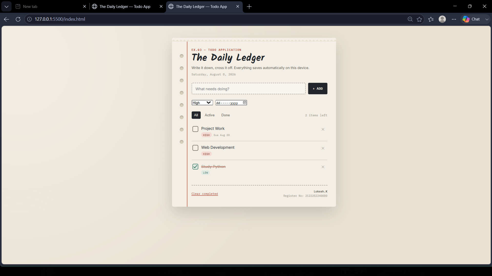

# Ex03 To-Do List using JavaScript
## Date:08/08/2026

## AIM
To create a To-do Application with all features using JavaScript.

## ALGORITHM
### STEP 1
Build the HTML structure (index.html).

### STEP 2
Style the App (style.css).

### STEP 3
Plan the features the To-Do App should have.

### STEP 4
Create a To-do application using Javascript.

### STEP 5
Add functionalities.

### STEP 6
Test the App.

### STEP 7
Open the HTML file in a browser to check layout and functionality.

### STEP 8
Fix styling issues and refine content placement.

### STEP 9
Deploy the website.

### STEP 10
Upload to GitHub Pages for free hosting.

## PROGRAM
HTML
~~~

<html lang="en">
<head>
<meta charset="UTF-8">
<meta name="viewport" content="width=device-width, initial-scale=1.0">
<title>The Daily Ledger — Todo App</title>
<link rel="preconnect" href="https://fonts.googleapis.com">
<link href="https://fonts.googleapis.com/css2?family=Kalam:wght@400;700&family=IBM+Plex+Mono:wght@400;500;600&family=Inter:wght@400;500;600;700&display=swap" rel="stylesheet">
<link rel="stylesheet" href="style.css">
</head>
<body>
 

  

    
  

  

 
  

    <header>
      
Ex.03 — Todo Application

      <h1>The Daily Ledger</h1>
      
Write it down, cross it off. Everything saves automatically on this device.

      

    </header>
 
    

      <input type="text" id="taskInput" placeholder="What needs doing?" maxlength="140" autocomplete="off">
      <button class="add-btn" id="addBtn">+ ADD</button>
    

    

      <select id="prioritySelect" aria-label="Priority">
        <option value="low">Low</option>
        <option value="medium" selected>Medium</option>
        <option value="high">High</option>
      </select>
      <input type="date" id="dueInput" aria-label="Due date">
    

 
    

      

        <button data-filter="all" class="active">All</button>
        <button data-filter="active">Active</button>
        <button data-filter="done">Done</button>
      

      0 items left
    

 
    <ul id="list"></ul>
    
Nothing on the page yet — add your first task above.

 
    <footer class="app-footer">
      <button class="clear-btn" id="clearDone">Clear completed</button>
      

        <b>Lokesh.K</b> 
        Register No: 2122252240080
      

    </footer>
  

 

</body>
</html>
~~~

CSS
~~~
:root{
  --paper:#f3efe6;
  --paper-dark:#e9e2d2;
  --margin-red:#b5442e;
  --ink:#22252a;
  --ink-soft:#5b564c;
  --pencil:#9a9284;
  --teal:#2f6e5b;
  --teal-soft:#dfe9e2;
  --shadow:rgba(34,37,42,0.18);
  --hole:#d8cfba;
}

*{ box-sizing:border-box; }

body{
  margin:0;
  min-height:100vh;
  background:
    radial-gradient(circle at 20% 10%, rgba(255,255,255,0.4), transparent 40%),
    var(--paper-dark);
  font-family:'Inter', sans-serif;
  color:var(--ink);
  display:flex;
  align-items:flex-start;
  justify-content:center;
  padding:48px 20px;
}

.page{
  position:relative;
  width:100%;
  max-width:640px;
  background:var(--paper);
  border-radius:6px;
  box-shadow:0 24px 60px var(--shadow), 0 2px 0 rgba(255,255,255,0.5) inset;
  overflow:hidden;
}

/* torn top edge */
.page::before{
  content:"";
  position:absolute;
  top:0; left:0; right:0;
  height:14px;
  background:
    linear-gradient(135deg, var(--paper) 50%, transparent 50%) 0 0/14px 14px repeat-x,
    linear-gradient(-135deg, var(--paper) 50%, transparent 50%) 0 0/14px 14px repeat-x;
  background-color:var(--paper-dark);
  z-index:2;
}

.sheet{
  position:relative;
  padding:40px 34px 34px 76px;
}

/* spiral holes */
.holes{
  position:absolute;
  left:30px; top:0; bottom:0;
  width:14px;
  display:flex;
  flex-direction:column;
  justify-content:flex-start;
  gap:34px;
  padding-top:64px;
}
.holes span{
  width:14px; height:14px;
  border-radius:50%;
  background:var(--hole);
  box-shadow: inset 0 2px 3px rgba(0,0,0,0.25);
}

/* red margin rule */
.margin-rule{
  position:absolute;
  left:58px; top:0; bottom:0;
  width:2px;
  background:var(--margin-red);
  opacity:0.55;
}

header{
  margin-bottom:26px;
}
.eyebrow{
  font-family:'IBM Plex Mono', monospace;
  font-size:11px;
  letter-spacing:0.14em;
  text-transform:uppercase;
  color:var(--margin-red);
  font-weight:600;
  margin:0 0 6px;
}
h1{
  font-family:'Kalam', cursive;
  font-size:38px;
  line-height:1.05;
  margin:0 0 8px;
  font-weight:700;
  color:var(--ink);
}
.subtitle{
  font-size:13.5px;
  color:var(--ink-soft);
  margin:0;
}
.date-today{
  font-family:'IBM Plex Mono', monospace;
  font-size:12px;
  color:var(--pencil);
  margin-top:10px;
}

/* add row */
.add-row{
  display:flex;
  gap:10px;
  margin-bottom:22px;
}
.add-row input[type="text"]{
  flex:1;
  font-family:'Inter', sans-serif;
  font-size:14.5px;
  padding:12px 14px;
  border:1.5px dashed var(--pencil);
  border-radius:4px;
  background:rgba(255,255,255,0.4);
  color:var(--ink);
  outline:none;
  transition:border-color .15s ease, background .15s ease;
}
.add-row input[type="text"]:focus{
  border-color:var(--margin-red);
  background:rgba(255,255,255,0.75);
}
.add-row select{
  font-family:'IBM Plex Mono', monospace;
  font-size:12px;
  padding:0 10px;
  border:1.5px dashed var(--pencil);
  border-radius:4px;
  background:rgba(255,255,255,0.4);
  color:var(--ink-soft);
}
.add-row input[type="date"]{
  font-family:'IBM Plex Mono', monospace;
  font-size:12px;
  padding:0 8px;
  border:1.5px dashed var(--pencil);
  border-radius:4px;
  background:rgba(255,255,255,0.4);
  color:var(--ink-soft);
  width:132px;
}
.add-btn{
  font-family:'IBM Plex Mono', monospace;
  font-weight:600;
  font-size:13px;
  border:none;
  border-radius:4px;
  padding:0 18px;
  background:var(--ink);
  color:var(--paper);
  cursor:pointer;
  transition:transform .1s ease, background .15s ease;
}
.add-btn:hover{ background:var(--margin-red); }
.add-btn:active{ transform:scale(0.96); }

.add-row2{
  display:flex;
  gap:10px;
  margin-bottom:24px;
}

/* filters */
.toolbar{
  display:flex;
  align-items:center;
  justify-content:space-between;
  margin-bottom:14px;
  flex-wrap:wrap;
  gap:10px;
}
.filters{
  display:flex;
  gap:6px;
  font-family:'IBM Plex Mono', monospace;
  font-size:12px;
}
.filters button{
  border:none;
  background:transparent;
  color:var(--ink-soft);
  padding:6px 10px;
  border-radius:4px;
  cursor:pointer;
  letter-spacing:0.03em;
}
.filters button.active{
  background:var(--ink);
  color:var(--paper);
}
.count{
  font-family:'IBM Plex Mono', monospace;
  font-size:12px;
  color:var(--pencil);
}

/* list */
ul#list{
  list-style:none;
  margin:0;
  padding:0;
}
.todo{
  display:flex;
  align-items:flex-start;
  gap:12px;
  padding:14px 4px;
  border-bottom:1px solid rgba(90,84,72,0.18);
  cursor:grab;
}
.todo.dragging{ opacity:0.4; }
.todo:last-child{ border-bottom:none; }

.check{
  flex:none;
  width:22px; height:22px;
  margin-top:1px;
  border:2px solid var(--ink-soft);
  border-radius:5px;
  background:transparent;
  cursor:pointer;
  position:relative;
  padding:0;
}
.todo.done .check{
  border-color:var(--teal);
  background:var(--teal-soft);
}
.check svg{
  position:absolute; inset:0;
  width:100%; height:100%;
  stroke:var(--teal);
  stroke-width:3;
  fill:none;
  stroke-linecap:round;
  stroke-linejoin:round;
  stroke-dasharray:24;
  stroke-dashoffset:24;
  transition:stroke-dashoffset .25s ease;
}
.todo.done .check svg{ stroke-dashoffset:0; }

.todo-body{ flex:1; min-width:0; }
.todo-text{
  font-size:15px;
  line-height:1.4;
  word-break:break-word;
  outline:none;
}
.todo.done .todo-text{
  color:var(--pencil);
  text-decoration:line-through;
  text-decoration-color:var(--margin-red);
  text-decoration-thickness:1.5px;
}
.meta-row{
  display:flex;
  gap:8px;
  margin-top:5px;
  align-items:center;
}
.tag{
  font-family:'IBM Plex Mono', monospace;
  font-size:10.5px;
  padding:2px 7px;
  border-radius:999px;
  letter-spacing:0.03em;
  text-transform:uppercase;
}
.tag.high{ background:#f4d9d3; color:#8a2e1c; }
.tag.medium{ background:#f3ecd0; color:#7a6414; }
.tag.low{ background:var(--teal-soft); color:var(--teal); }
.due{
  font-family:'IBM Plex Mono', monospace;
  font-size:10.5px;
  color:var(--pencil);
}
.due.overdue{ color:var(--margin-red); font-weight:600; }

.todo-actions{
  display:flex;
  gap:4px;
  flex:none;
}
.icon-btn{
  border:none;
  background:transparent;
  color:var(--pencil);
  width:26px; height:26px;
  border-radius:4px;
  cursor:pointer;
  font-size:14px;
  display:flex;
  align-items:center;
  justify-content:center;
  transition:background .12s ease, color .12s ease;
}
.icon-btn:hover{ background:rgba(90,84,72,0.12); color:var(--ink); }
.icon-btn.delete:hover{ background:#f4d9d3; color:var(--margin-red); }

.empty-state{
  text-align:center;
  padding:36px 10px;
  color:var(--pencil);
  font-family:'Kalam', cursive;
  font-size:18px;
}

footer.app-footer{
  margin-top:26px;
  padding-top:16px;
  border-top:1.5px dashed var(--pencil);
  display:flex;
  justify-content:space-between;
  align-items:center;
  flex-wrap:wrap;
  gap:10px;
}
.clear-btn{
  font-family:'IBM Plex Mono', monospace;
  font-size:11.5px;
  border:none;
  background:transparent;
  color:var(--margin-red);
  cursor:pointer;
  text-decoration:underline;
  padding:0;
}
.credit{
  font-family:'IBM Plex Mono', monospace;
  font-size:11px;
  color:var(--pencil);
  text-align:right;
  line-height:1.5;
}
.credit b{ color:var(--ink-soft); }

@media (max-width:480px){
  .sheet{ padding:34px 20px 26px 58px; }
  .holes{ left:16px; }
  .margin-rule{ left:40px; }
  h1{ font-size:30px; }
  .add-row2{ flex-wrap:wrap; }
  .add-row2 input[type="date"]{ width:auto; flex:1; }
}

:focus-visible{ outline:2px solid var(--margin-red); outline-offset:2px; }

@media (prefers-reduced-motion: reduce){
  *{ transition:none !important; animation:none !important; }
}
~~~
JAVASCRIPT
~~~
const STORAGE_KEY = 'daily-ledger-todos-v1';

const listEl = document.getElementById('list');
const inputEl = document.getElementById('taskInput');
const addBtn = document.getElementById('addBtn');
const prioritySelect = document.getElementById('prioritySelect');
const dueInput = document.getElementById('dueInput');
const filtersEl = document.getElementById('filters');
const countLabel = document.getElementById('countLabel');
const emptyState = document.getElementById('emptyState');
const clearDoneBtn = document.getElementById('clearDone');
const todayDateEl = document.getElementById('todayDate');

let todos = [];
let currentFilter = 'all';
let dragSrcId = null;

// ---- init ----
todayDateEl.textContent = new Date().toLocaleDateString(undefined, { weekday:'long', year:'numeric', month:'long', day:'numeric' });
load();
render();

// ---- storage ----
function load(){
  try{
    const raw = localStorage.getItem(STORAGE_KEY);
    todos = raw ? JSON.parse(raw) : [];
  }catch(e){
    todos = [];
  }
}
function save(){
  try{
    localStorage.setItem(STORAGE_KEY, JSON.stringify(todos));
  }catch(e){ /* storage unavailable, fail silently */ }
}

// ---- helpers ----
function uid(){
  return 't' + Date.now().toString(36) + Math.random().toString(36).slice(2,7);
}
function isOverdue(due, done){
  if(!due || done) return false;
  const today = new Date(); today.setHours(0,0,0,0);
  const d = new Date(due + 'T00:00:00');
  return d < today;
}
function formatDue(due){
  const d = new Date(due + 'T00:00:00');
  return d.toLocaleDateString(undefined, { month:'short', day:'numeric' });
}
function escapeHtml(str){
  const div = document.createElement('div');
  div.textContent = str;
  return div.innerHTML;
}

// ---- CRUD ----
function addTodo(){
  const text = inputEl.value.trim();
  if(!text){ inputEl.focus(); return; }
  todos.unshift({
    id: uid(),
    text,
    done:false,
    priority: prioritySelect.value,
    due: dueInput.value || null,
    createdAt: Date.now()
  });
  inputEl.value = '';
  dueInput.value = '';
  save();
  render();
  inputEl.focus();
}

function toggleDone(id){
  const t = todos.find(t => t.id === id);
  if(t){ t.done = !t.done; save(); render(); }
}

function deleteTodo(id){
  todos = todos.filter(t => t.id !== id);
  save();
  render();
}

function editTodoText(id, newText){
  const t = todos.find(t => t.id === id);
  if(!t) return;
  const clean = newText.trim();
  if(clean){ t.text = clean; } // ignore empty edits, revert on render
  save();
  render();
}

function clearCompleted(){
  todos = todos.filter(t => !t.done);
  save();
  render();
}

function reorder(srcId, targetId){
  const srcIdx = todos.findIndex(t => t.id === srcId);
  const tgtIdx = todos.findIndex(t => t.id === targetId);
  if(srcIdx === -1 || tgtIdx === -1 || srcIdx === tgtIdx) return;
  const [moved] = todos.splice(srcIdx, 1);
  todos.splice(tgtIdx, 0, moved);
  save();
  render();
}

// ---- render ----
function getFiltered(){
  if(currentFilter === 'active') return todos.filter(t => !t.done);
  if(currentFilter === 'done') return todos.filter(t => t.done);
  return todos;
}

function render(){
  const filtered = getFiltered();
  listEl.innerHTML = '';

  filtered.forEach(t => {
    const li = document.createElement('li');
    li.className = 'todo' + (t.done ? ' done' : '');
    li.draggable = true;
    li.dataset.id = t.id;

    const overdue = isOverdue(t.due, t.done);

    li.innerHTML = `
      <button class="check" aria-label="Toggle complete" data-action="toggle">
        <svg viewBox="0 0 24 24"><polyline points="4,13 9,18 20,6"></polyline></svg>
      </button>
      

        
${escapeHtml(t.text)}

        

          ${t.priority}
          ${t.due ? `${overdue ? 'Overdue · ' : 'Due '}${formatDue(t.due)}` : ''}
        

      

      

        <button class="icon-btn delete" title="Delete" data-action="delete">✕</button>
      

    `;
    listEl.appendChild(li);
  });

  emptyState.style.display = filtered.length === 0 ? 'block' : 'none';

  const remaining = todos.filter(t => !t.done).length;
  countLabel.textContent = `${remaining} item${remaining === 1 ? '' : 's'} left`;
}

// ---- events ----
addBtn.addEventListener('click', addTodo);
inputEl.addEventListener('keydown', e => { if(e.key === 'Enter') addTodo(); });

filtersEl.addEventListener('click', e => {
  const btn = e.target.closest('button[data-filter]');
  if(!btn) return;
  currentFilter = btn.dataset.filter;
  [...filtersEl.children].forEach(b => b.classList.toggle('active', b === btn));
  render();
});

clearDoneBtn.addEventListener('click', clearCompleted);

listEl.addEventListener('click', e => {
  const li = e.target.closest('.todo');
  if(!li) return;
  const id = li.dataset.id;
  const action = e.target.closest('[data-action]')?.dataset.action;
  if(action === 'toggle') toggleDone(id);
  if(action === 'delete') deleteTodo(id);
});

listEl.addEventListener('focusout', e => {
  const target = e.target.closest('[data-action="edit"]');
  if(!target) return;
  const li = target.closest('.todo');
  const id = li.dataset.id;
  editTodoText(id, target.textContent);
});

listEl.addEventListener('keydown', e => {
  if(e.target.closest('[data-action="edit"]') && e.key === 'Enter'){
    e.preventDefault();
    e.target.blur();
  }
});

// drag to reorder
listEl.addEventListener('dragstart', e => {
  const li = e.target.closest('.todo');
  if(!li) return;
  dragSrcId = li.dataset.id;
  li.classList.add('dragging');
  e.dataTransfer.effectAllowed = 'move';
});
listEl.addEventListener('dragend', e => {
  const li = e.target.closest('.todo');
  if(li) li.classList.remove('dragging');
});
listEl.addEventListener('dragover', e => {
  e.preventDefault();
});
listEl.addEventListener('drop', e => {
  e.preventDefault();
  const li = e.target.closest('.todo');
  if(!li || !dragSrcId) return;
  const targetId = li.dataset.id;
  reorder(dragSrcId, targetId);
  dragSrcId = null;
});
~~~

## OUTPUT

## RESULT
The program for creating To-do list using JavaScript is executed successfully.
